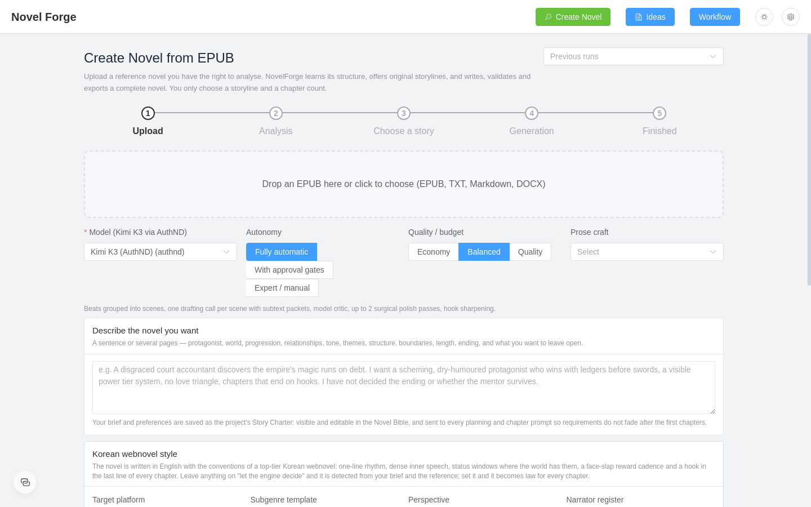
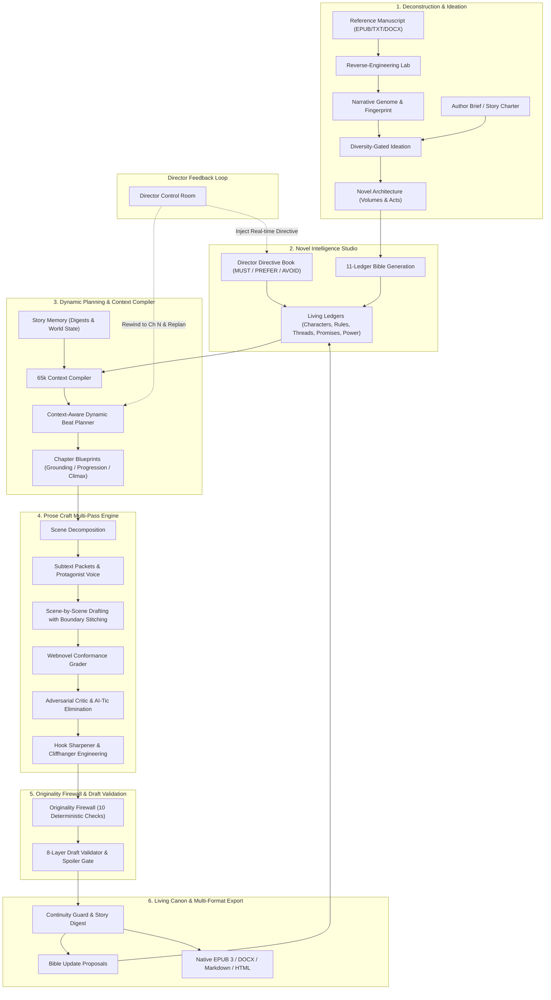
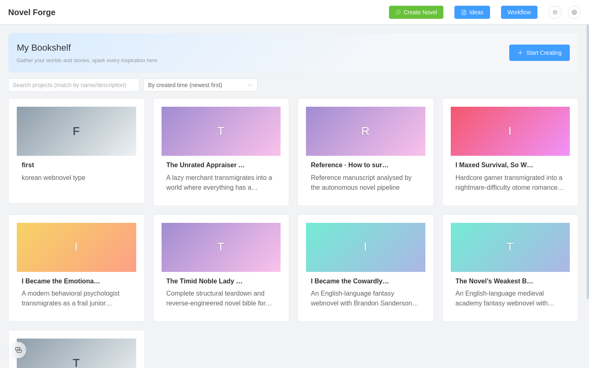
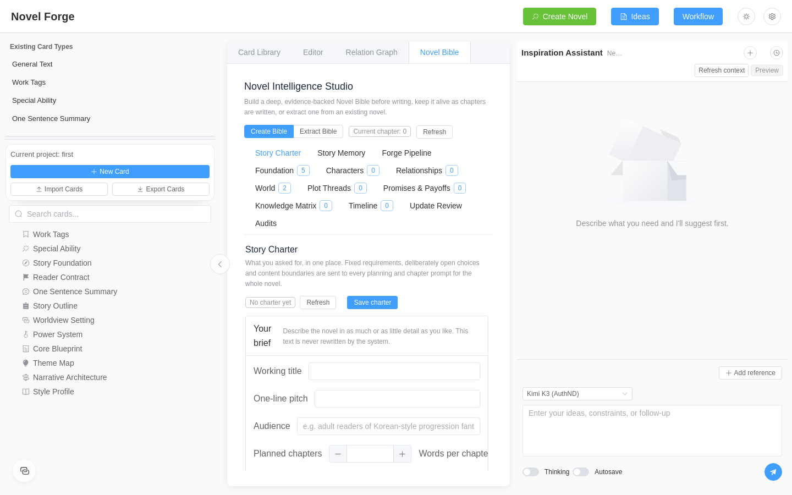
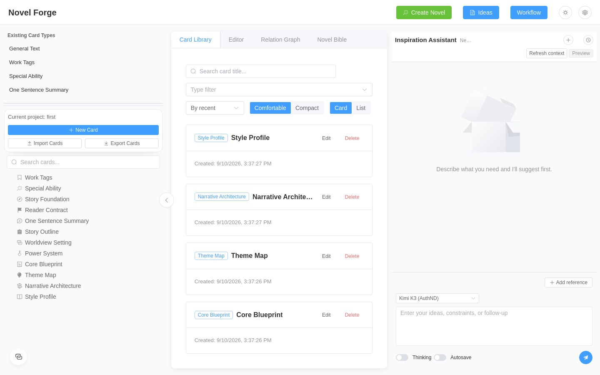

<div align="center">

# NovelForge-EN

**Next-Generation Autonomous AI Novel Engineering Platform & Narrative Studio**

[](https://github.com/Sigmaaaaa12343/NovelForge-EN/tree/main)
[](https://www.gnu.org/licenses/agpl-3.0)
[](https://www.python.org/)
[](https://fastapi.tiangolo.com/)
[](https://vuejs.org/)
[](https://www.typescriptlang.org/)
[](https://www.electronjs.org/)
[](https://www.sqlite.org/)
[](https://neo4j.com/)

<p>
  <a href="#-table-of-contents">Contents</a> •
  <a href="#-system-architecture">Architecture</a> •
  <a href="#-core-systems-deep-dive">Core Systems</a> •
  <a href="#-visual-tour--screenshots">Visual Tour</a> •
  <a href="#-getting-started">Getting Started</a> •
  <a href="#-creation-modes">Creation Modes</a> •
  <a href="#-prose-craft-presets">Prose Craft</a> •
  <a href="#-api-reference">API Reference</a> •
  <a href="#-specialized-docs">Documentation</a>
</p>

<p align="center">
  
</p>

</div>

---

## ℹ️ Repository Notice & English Fork Heritage

**NovelForge-EN** is the production-hardened English narrative engineering platform and autonomous novel generation system, maintaining active upstream synchronization with **[Sigmaaaaa12343/NovelForge-EN](https://github.com/Sigmaaaaa12343/NovelForge-EN/tree/main)**.

Originally forked from [RhythmicWave/NovelForge](https://github.com/RhythmicWave/NovelForge), this English distribution has evolved into a complete, enterprise-grade AI novel production suite:
- **Full English Localization & Hardened Architecture**: All backend services, data models, prompt templates, seed knowledge bases, and Vue 3 / Electron UI elements are natively localized and hardened.
- **Autonomous Novel Engine**: End-to-end reference EPUB deconstruction, narrative genome reverse-engineering, dynamic context-aware chapter beat planning, multi-pass scene drafting, and episodic publishing.
- **Webnovel Serialization Standards**: Built-in support for Korean webnovel prose dynamics (Novelpia, Munpia, KakaoPage, Naver Series, Royal Road) with deterministic conformance grading.
- **Author-Centric Reliability**: 65k context compiler, immutable server-side snapshots, live Director control room, and author field locks ensuring zero context drift or data loss.

---

<a id="-table-of-contents"></a>
## 📑 Table of Contents

- [🌟 Platform Overview](#-platform-overview)
- [🏗️ System Architecture](#-system-architecture)
- [⚡ 12 Core Systems Deep-Dive](#-core-systems-deep-dive)
  - [1. Autonomous Novel Pipeline (17-Stage Engine)](#1-autonomous-novel-pipeline-17-stage-engine)
  - [2. Director Deep-Input & Live Control Room](#2-director-deep-input--live-control-room)
  - [3. Novel Deconstruction Lab & Narrative Genome](#3-novel-deconstruction-lab--narrative-genome)
  - [4. Webnovel Style Engine & Conformance Grader](#4-webnovel-style-engine--conformance-grader)
  - [5. Prose Craft Multi-Pass Engine](#5-prose-craft-multi-pass-engine)
  - [6. Originality Firewall & Anti-Leakage Suite (10 Deterministic Checks)](#6-originality-firewall--anti-leakage-suite-10-deterministic-checks)
  - [7. 65k Context Compiler & Story Memory](#7-65k-context-compiler--story-memory)
  - [8. Proposition-Level Spoiler Engine & 8-Layer Draft Validator](#8-proposition-level-spoiler-engine--8-layer-draft-validator)
  - [9. Novel Intelligence Studio (Novel Bible 2.0 with 11 Ledgers)](#9-novel-intelligence-studio-novel-bible-20-with-11-ledgers)
  - [10. Foreshadowing & Setup-Payoff Lifecycle Engine](#10-foreshadowing--setup-payoff-lifecycle-engine)
  - [11. Studio Workbench, Cards, Inspiration Assistant & Workflow Engine](#11-studio-workbench-cards-inspiration-assistant--workflow-engine)
  - [12. Enterprise Hardening, Safety & Multi-Format Export Suite](#12-enterprise-hardening-safety--multi-format-export-suite)
- [📸 Visual Tour & Screenshot Showcase](#-visual-tour--screenshots)
- [🚀 Getting Started](#-getting-started)
  - [Prerequisites](#prerequisites)
  - [Windows Quick Start (One-Click)](#windows-quick-start-one-click)
  - [Linux / macOS Installation](#linux--macos-installation)
  - [LLM Provider Configuration & Auth Drivers](#llm-provider-configuration--auth-drivers)
- [🎨 Creation Workflows](#-creation-modes)
- [✒️ Prose Craft Presets Comparison](#-prose-craft-presets)
- [🎭 19 Webnovel Subgenres & Platforms](#-webnovel-subgenres)
- [⚙️ Workflow Studio Node Catalog](#️-workflow-studio-node-catalog)
- [🔌 Comprehensive API & Endpoint Reference](#-api-reference)
- [📂 Project Directory Structure](#-project-directory-structure)
- [📚 Technical Documentation Index](#-specialized-docs)
- [🤝 Contributing & License](#-contributing--license)

---

<a id="-platform-overview"></a>
## 🌟 Platform Overview

Writing a coherent, commercially viable long-form novel (100,000 to 1,000,000+ words) using generic LLMs fails because:
1. **Context Drift**: Characters forget their injuries, items teleport across continents, and established magic costs vanish.
2. **AI Slop Prose**: Text fills with repetitive tropes, melodrama, therapy-speak, and cliché phrasing (*"a testament to"*, *"not X, but Y"*, *"a breath he didn't know he was holding"*).
3. **Pacing Collapse**: Early chapters rush through dopamine hits without narrative grounding, or middle chapters stall in endless repetitive dialogue loops.
4. **Lack of Mid-Flight Controllability**: The author cannot steer the direction without throwing away the entire manuscript or breaking canon.
5. **Premature Spoiler Leaks**: Models rush future plot points into early chapters, destroying suspense and narrative progression.

**NovelForge-EN** resolves these architectural flaws through an interlocking suite of deterministic compilers, living ledgers, multi-pass craft engines, and real-time author control channels.

| Challenge in AI Novel Writing | How NovelForge-EN Solves It |
| :--- | :--- |
| **Context Amnesia** | **Living Story Memory**: Automatic Chapter Digests + Deterministic *Story So Far* compiler injecting tiered history and carry-forward world states into a 65k token budget. |
| **AI Slop & Repetitive Tics** | **Prose Craft & Tic Scrubbing**: Multi-pass scene drafting with subtext packets, protagonist voice profiles, and deterministic 50+ AI-tic catalogue elimination. |
| **Uncalibrated Dopamine & Rhythm** | **Webnovel Style Engine**: Platform conventions (Novelpia, KakaoPage), dynamic beat pacing (2–3 grounding beats in Ch 1 vs. 4–6 in climax), and 6-dimension conformance grading. |
| **Premature Spoilers & Outline Leaks** | **Proposition-Level Spoiler Engine**: Bounded 5-chapter future outline windows, sentence indexing, and copular identity verification preventing early reveals. |
| **Uncontrollable Generation** | **Director Control Room**: Live Directive Book (MUST / PREFER / AVOID / IDEA) and instant *Canon Rewind & Replan* from chapter N. |
| **Accidental Overwrites** | **Manuscript Safety Suite**: Automatic SQLite pre-migration backups, author field locks, and immutable server-side revision snapshots with full diff & restore. |

---

<a id="-system-architecture"></a>
## 🏗️ System Architecture

The following diagram illustrates the end-to-end narrative lifecycle within NovelForge-EN:



---

<a id="-core-systems-deep-dive"></a>
## ⚡ 12 Core Systems Deep-Dive

<a id="1-autonomous-novel-pipeline-17-stage-engine"></a>
### 1. Autonomous Novel Pipeline (17-Stage Engine)
NovelForge-EN coordinates an end-to-end state machine that can autonomously transform a raw concept or a reference manuscript into a complete serialized webnovel:

```
INGEST ➔ SOURCE_ANALYSIS ➔ ANALYSIS_VERIFICATION ➔ BOOK_STRUCTURE ➔ FINGERPRINT_BUILD
➔ EXAMPLE_LIBRARY_BUILD ➔ STORYLINE_GENERATION ➔ STORYLINE_SELECTION (Gate)
➔ NOVEL_ARCHITECTURE ➔ BIBLE_BUILD ➔ CHAPTER_PLAN_BUILD ➔ NOVEL_PREFLIGHT (Gate)
➔ CHAPTER_GENERATION_LOOP ➔ WHOLE_NOVEL_AUDIT ➔ GLOBAL_REPAIR ➔ EXPORT (Gate) ➔ DONE
```

- **Built-in Approval Gates**: Configurable for `fully_automatic`, `approval_gates` (pauses at Storyline Selection, Preflight, and Export), or `manual` mode.
- **Dynamic Beat Planning**: Calibrates scene count and beat rhythm dynamically based on narrative placement:
  - *Early Chapters (1–3)*: 2–3 expansive grounding beats focusing on physical orientation, sensory texture, transmigration/reincarnation reasoning, and inner monologue.
  - *Progression Chapters (4–15)*: 3–4 tactical progression beats advancing intermediate objectives.
  - *Climax & Escalation*: 4–6 rapid beats maximizing tension, reversals, and cliffhangers.
- **Distributed Worker Lease & Budget Ledger**: Each background job is fenced with durable lease ownership (`JobLeaseLost`), compare-and-set token reservations, and conservative recovery of in-flight requests.

<a id="2-director-deep-input--live-control-room"></a>
### 2. Director Deep-Input & Live Control Room
Never lose control of an autonomous generation run. The **Director Control Room** allows authors to intervene dynamically in real time without restarting:
- **Live Directive Book**: Submit standing instructions at three distinct scopes:
  - `novel`: Applies globally across all remaining volumes.
  - `arc`: Governs the current volume or major plot arc.
  - `chapter`: Injected strictly into the immediate next chapter.
  - Categorized by authority: `MUST` (strict requirement), `PREFER` (soft preference), `AVOID` (negative constraint), and `IDEA` (creative inspiration).
- **Dynamic Canon Rewind & Replan**: If chapter 14 takes an unintended turn:
  1. Author enters: *"Redo from chapter 14: Protagonist conceals his skill from the guild master."*
  2. Canon, world state, and living ledgers immediately roll back to chapter 13.
  3. Discarded chapters are preserved in an immutable history archive.
  4. The chapter blueprint window is dynamically re-planned under the new directive.
  5. Generation resumes seamlessly.

<a id="3-novel-deconstruction-lab--narrative-genome"></a>
### 3. Novel Deconstruction Lab & Narrative Genome
Reverse-engineer masterwork novels into structural blueprints:
- **Universal Manuscript Ingestion**: Ingests EPUB 2/3, DOCX, Markdown, TXT, and HTML. Detects chapter boundaries via spine indexing, regex patterns, and heading heuristics with encoding anomaly normalization.
- **Narrative Fingerprint**: Measures dialogue-to-action ratios, interiority share, sentence/paragraph density, and rhythm distributions without copying lore.
- **Narrative Genome & Exemplar Scene Mining**: Extracts abstract scene functions (e.g., *Public Challenge*, *Secret Transaction*, *Power Awakening*) and mines few-shot structural examples with all names, settings, and proprietary lore stripped clean.
- **Narrative Transfer**: Projects the structural pacing, tension curves, and rhythm of a masterwork novel onto an entirely original story charter.

<a id="4-webnovel-style-engine--conformance-grader"></a>
### 4. Webnovel Style Engine & Conformance Grader
Traditional LLM prose sounds like dry Western literary fiction. The **Webnovel Style Engine** enforces authentic serialized webnovel craft:
- **Mobile-Optimized Rhythm**: Short, punchy 1–2 sentence paragraphs optimized for mobile reading.
- **Dual-Layer Interiority**: The protagonist's private commentary rendered in `'single quotes'` immediately following significant dialogue or high-stakes developments.
- **Status & System Windows**: Clean, bracketed status blocks (`[System]`, `[Skill Activated]`) treated as narrative beats rather than dumped text.
- **19 Subgenre Archetypes**: Instant calibration for Regression, System Apocalypse, Hunter/Gate, Tower Climb, Murim, Cultivation, Villainess Transmigration, Academy, and more.
- **Deterministic 6-Dimension Conformance Grader**: Analyzes every draft without model overhead:
  1. *Rhythm*: Paragraph lengths, sentence density, and line-break cadence.
  2. *Inner Voice*: Frequency and placement of protagonist private verdicts.
  3. *Conventions*: Status window formatting, SFX lines, and English-adapted address forms.
  4. *Momentum*: Forward narrative velocity and absence of recap bloat.
  5. *Reward Cadence*: Frequency of micro-payoffs, reputation shifts, and face-slaps.
  6. *Ending Hook*: Detection of cliffhanger strength vs. passive fade-outs.

<a id="5-prose-craft-multi-pass-engine"></a>
### 5. Prose Craft Multi-Pass Engine
Chapter generation is split into dedicated, specialized architectural passes:
- **Scene-by-Scene Decomposition**: Beats are grouped into 2–4 cohesive scenes. Each scene is drafted with a dedicated brief carrying forward the previous scene's *exact* ending lines, last speaker, physical coordinates, and carried tension.
- **Character Subtext Packets**: Before drafting dialogue, the engine compiles:
  - What each present character wants from the protagonist.
  - What they are actively suppressing or concealing.
  - Leverage, conversational tactics, and speech mannerisms.
  - What the protagonist is likely to misread.
- **Protagonist Voice Dossier**: Injects private humor, self-deception patterns, calculation styles, and cognitive biases.
- **Deterministic AI-Tic Elimination**: Identifies and scrubs over 50 mechanical AI prose habits:
  - *"Not X, but Y"* / *"Not merely X, but Y"*
  - *"A testament to..."* / *"A silent reminder of..."*
  - *"The man who..."* / *"The woman who..."*
  - *"A breath he didn't know he was holding"*
  - Emotional cocktail stacking (*"A mixture of fear, awe, and grudging respect"*)
  - Therapy-speak and anachronistic psychological jargon
- **Hook Sharpener**: Detects soft endings and rewrites the final lines into crisis, revelation, decision, or threat-arrival cliffhangers.

<a id="6-originality-firewall--anti-leakage-suite-10-deterministic-checks"></a>
### 6. Originality Firewall & Anti-Leakage Suite (10 Deterministic Checks)
When writing novels inspired by reference manuscripts, NovelForge-EN protects original authorship through a 10-layer deterministic firewall:
1. **Named-Entity Overlap**: Flags source entity names and aliases.
2. **Distinctive-Term Overlap**: Tracks rare capitalized terms with clustering thresholds so isolated words don't trigger false positives.
3. **Long Phrase Overlap**: Detects exact shared token windows ($N \ge 8$ tokens).
4. **Dialogue Overlap**: Scans for quoted dialogue lines shared with the source.
5. **Rare N-gram Overlap**: Flags 4-grams common in the source but rare in general literature.
6. **Scene-Summary Similarity**: Computes token Jaccard similarity across scene summaries.
7. **Ordered Beat Sequence Similarity**: Evaluates Longest Common Subsequence (LCS) ratios over beat functions.
8. **Character-Role Mapping Similarity**: Prevents 1-to-1 character trait and role duplication.
9. **Location & Object Similarity**: Detects identical architectural or item attributes.
10. **Accidental Quotation Detection**: Identifies verbatim sentence spans located in the reference text.

<a id="7-65k-context-compiler--story-memory"></a>
### 7. 65k Context Compiler & Story Memory
To take full advantage of long-context models like **Kimi K3** and **Gemini 2.5 Pro**, NovelForge-EN utilizes an expanded **120,000 character (~30k–65k token)** context compiler:
- **Structured Chapter Digests**: After every chapter, background extraction isolates key events, persistent state changes, knowledge deltas, opened/closed hooks, promises, and physical endings.
- **Deterministic Story So Far Compiler**: Generates tiered recaps:
  - *Immediate Past (Last 3 Chapters)*: Full scene-level resolution.
  - *Current Arc (Chapters 4–15)*: Compressed beat summaries.
  - *Distant Canon*: Milestone summaries and permanent world alterations.
- **Carry-Forward World State**: Durably tracks who is injured, who holds specific key items, faction diplomatic states, and who is dead.
- **Continuity Guard**: Scans drafts for prohibited reveals, dead entities taking actions, teleporting characters, contradictory timelines, and dropped promises.

<a id="8-proposition-level-spoiler-engine--8-layer-draft-validator"></a>
### 8. Proposition-Level Spoiler Engine & 8-Layer Draft Validator
Eliminates the false-positive validation traps that stall long-form serials:
- **Proposition-Level Spoiler Engine (`spoilers.py`)**:
  - Distinguishes shared world vocabulary (*"gold"*, *"supply"*) from actual plot reveals (*"Corvin is revealed as the courier"*).
  - Uses sentence-index caching, inflectional stemmers, and copular identity verification (*"X was Y all along"*).
  - Bounded 5-chapter future outline window ensures distant outcomes in chapter 300 never block chapter 1.
- **8 Deterministic Draft Validation Layers**:
  1. *Entity Validation*: Source entity leakage and recurring unauthorized cast members (`recurring_threshold = 3`).
  2. *Fact Validation*: Canon contradictions, unauthorized deaths, unexpected teleportation, and duplicate payoffs.
  3. *Outline Validation*: Missing beats, out-of-order beats, and future beat advancement.
  4. *POV Validation*: Head-hopping in 3rd person, 1st-person POV drift, and prohibited knowledge surfacing.
  5. *Character Validation*: Consistency of speech mannerisms and prohibited speech phrases.
  6. *Temporal Validation*: Timeline anomalies, negative durations, and calendar inconsistencies.
  7. *Style Adherence*: Automated metric checks against target fingerprint ranges.
  8. *Originality Firewall Report*: Composite originality compliance scoring.

<a id="9-novel-intelligence-studio-novel-bible-20-with-11-ledgers"></a>
### 9. Novel Intelligence Studio (Novel Bible 2.0 with 11 Ledgers)
The **Novel Bible** is a living, evidence-backed knowledge network composed of 11 interlocking ledgers:
1. **Story Foundation**: Premise, themes, philosophical conflict, narrative tone.
2. **Reader Contract**: Genre promises, dopamine cadence, taboos, and payoff timetables.
3. **Theme Map**: Visualized motif progression and symbolic stakes.
4. **Power System & Rules**: Tier ladders, hard costs, limits, backlash mechanics, and resource scarcity.
5. **Character Dossiers & Voices**: Aliases, speech patterns, private agendas, and consistency rules.
6. **Relationship Matrices**: Dynamic tracking of Trust, Affection, Fear, Dependency, and Resentment.
7. **Knowledge Facts Matrix**: Tracks who knows what, who suspects what, and who holds false beliefs.
8. **Plot Threads Ledger**: Active, dormant, and resolved plot arcs with overdue alerts.
9. **Promises & Payoffs**: Explicit setup-and-payoff contracts with chapter deadlines.
10. **World Rules & Timeline**: Immutable physical laws and chronological event history.
11. **Webnovel Style Profile**: Platform targets, POV mechanics, and genre engines.

- **Living Bible Proposal System**: As chapters are written, the engine proposes lore updates. Authors can accept, reject, edit, or tag entries as *plan-not-canon*.
- **Author Field Locks**: Human edits are protected with author locks; automated background sync will never overwrite locked fields.

<a id="10-foreshadowing--setup-payoff-lifecycle-engine"></a>
### 10. Foreshadowing & Setup-Payoff Lifecycle Engine
Master long-form suspense through systematic clue tracking:
- **Lifecycle Tracking**: Tracks hints across four states: `planted` ➔ `reinforced` ➔ `misdirected` (red herrings) ➔ `paid_off`.
- **Evidence Chains**: Links every clue to physical objects, specific dialogue lines, or environmental details.
- **Overdue Payoff Alerts**: Warns the author or chapter planner when planted hooks exceed their intended resolution window.

<a id="11-studio-workbench-cards-inspiration-assistant--workflow-engine"></a>
### 11. Studio Workbench, Cards, Inspiration Assistant & Workflow Engine
For authors who prefer hands-on writing or hybrid collaboration:
- **Schema-First Card Modeling**: Define custom JSON Schemas for any entity type (`Settings → Card Types`) with inheritance, embedded records, and field-level validation.
- **Instruction-Streaming AI Card Generation**: Generate cards field-by-field in real time. Submit feedback to refine specific fields without regenerating the entire card.
- **Inspiration Assistant**: A dedicated conversational partner in the side panel equipped with ReAct tool-calling, cross-project card referencing, and thinking mode.
- **Ideas Workbench**: A scratchpad environment for brainstorming and collecting material that can be converted into formal project cards with one click.
- **Dual Graph Engine**: Store entity relationships in SQLite or connect directly to local **Neo4j** instances for Cypher-powered network queries.
- **Visual & Code-Style Workflow Studio**: Build deterministic or AI-assisted automation pipelines using Python-style execution syntax, with natural language generation via the **Workflow Agent**.

<a id="12-enterprise-hardening-safety--multi-format-export-suite"></a>
### 12. Enterprise Hardening, Safety & Multi-Format Export Suite
NovelForge-EN is built with strict production guarantees:
- **Automatic Pre-Migration Backups**: Every schema migration automatically creates a timestamped database backup (`.pre-<rev>-<stamp>.bak`).
- **Server-Side Revision History**: Every overwrite (manual save, AI regeneration, or architecture upsert) creates an immutable server snapshot with diff viewing and one-click rollback.
- **Multi-Format Export Suite**:
  - *EPUB 3 & EPUB 2*: Clean navigation documents (`nav.xhtml`), NCX fallback, custom CSS styling, metadata, and per-chapter XHTML files.
  - *Native Microsoft Word (DOCX)*: Clean `.docx` files with heading hierarchies, page breaks, and standard font styles produced natively via standard library XML (zero heavy python-docx dependency).
  - *Webnovel Episodic HTML & Markdown*: Formatted bundles ready for web publishing platforms.
  - *Audit Reports*: Export comprehensive JSON/Markdown reports covering continuity, rewards, and originality metrics.
- **Credential Masking & Local Isolation**: All LLM keys are encrypted locally and masked in UI and API responses (`••••last4`). Zero system-wide VPN requirements.

---

<a id="-visual-tour--screenshots"></a>
## 📸 Visual Tour & Screenshot Showcase

### 1. Autonomous Novel Studio & Creation Wizard
Configure full autonomous pipeline runs: upload a reference manuscript, set quality presets, define the Story Charter brief, and choose your Webnovel Style Profile.

<p align="center">
  
</p>

---

### 2. Project Bookshelf & Dashboard
Centralized management for all your creative projects, reverse-engineered reference bibles, and active manuscripts.

<p align="center">
  
</p>

---

### 3. Novel Intelligence Studio & Story Charter
The living command center for world lore, character dossiers, plot threads, and the foundational Story Charter.

<p align="center">
  
</p>

---

### 4. Card Library, Card Hierarchy & Inspiration Assistant
Explore structured project cards, manage parent-child relationships, and brainstorm with the ReAct Inspiration Assistant.

<p align="center">
  
</p>

---

### 5. Chapter Studio: Context Injection & Writing Environment
The core drafting environment with real-time entity context injection, word-count control, and quick contextual polishing.

<p align="center">
  
  
</p>

---

### 6. Streaming Field-Level AI Card Generation
Field-by-field interactive AI generation. Review, refine, and provide feedback on individual fields before committing.

<p align="center">
  
  
</p>

---

### 7. Workflow Studio & Natural Language Workflow Agent
Build automated pipeline workflows visually or via Python-style code, or let the natural language Workflow Agent construct them for you.

<p align="center">
  
  
</p>

<p align="center">
  
</p>

---

### 8. Schema-First Studio & Knowledge Graph
Design dynamic card data schemas and explore entity relationship networks stored in SQLite or Neo4j.

<p align="center">
  
  
</p>

---

### 9. Ideas Workbench
A free-form creative scratchpad for capturing inspiration, cross-referencing lore, and migrating ideas into formal novel projects.

<p align="center">
  
  
</p>

---

<a id="-getting-started"></a>
## 🚀 Getting Started

<a id="prerequisites"></a>
### Prerequisites
- **Python**: Version `3.11` or `3.12`
- **Node.js**: Version `18.x` or `20.x` with `npm`
- **Operating System**: Windows 10/11, macOS, or Linux (Ubuntu 20.04+)
- **Optional**: Neo4j Desktop 5.16+ (SQLite is enabled by default for graph relationships)

---

<a id="windows-quick-start-one-click"></a>
### Windows Quick Start (One-Click)

The repository root includes three automated batch scripts:

1. **Install Dependencies**:
   ```bat
   install.bat
   ```
   *Creates the Python virtual environment at `backend/venv`, installs backend requirements, and runs `npm install` for the frontend.*

2. **Start Backend Server**:
   ```bat
   run-backend.bat
   ```
   *Starts the FastAPI backend at `http://127.0.0.1:54321`.*

3. **Start Frontend Client**:
   ```bat
   run-frontend.bat
   ```
   *Launches the Electron desktop application and Vite dev server.*

---

<a id="linux--macos-installation"></a>
### Linux / macOS Installation

```bash
# 1. Clone the repository
git clone https://github.com/Sigmaaaaa12343/NovelForge-EN.git
cd NovelForge-EN

# 2. Setup Backend Environment
cd backend
python3 -m venv venv
source venv/bin/activate
pip install --upgrade pip
pip install -r requirements.txt

# Configure environment
cp .env.example .env

# Run database migrations
alembic upgrade head

# Start FastAPI backend
python3 main.py
```

In a second terminal:

```bash
# 3. Setup and Launch Frontend
cd NovelForge-EN/frontend
npm install

# Run as Electron desktop app:
npm run dev

# Or run in standard web browser mode:
npm run dev:web
```

Open your browser to `http://localhost:5173` if running in web mode.

---

<a id="llm-provider-configuration--auth-drivers"></a>
### LLM Provider Configuration & Auth Drivers

Navigate to **Settings → LLM Config** in the app to configure your model credentials. NovelForge-EN supports all major AI providers and native drivers:

- **Kimi K3 (Moonshot AI)**: Native `authnd` driver supporting automatic token refresh and quota tracking. Recommended for the 65k context compiler autonomous pipeline.
- **Genspark (GPT-5.6 Sol / Claude Opus 4.6)**: Built-in session driver for high-intelligence reasoning and narrative drafting.
- **OpenAI**: GPT-4o, GPT-4o-mini, o1, o3-mini.
- **Anthropic**: Claude 3.5 Sonnet, Claude 3.7 Sonnet.
- **Google Gemini**: Gemini 1.5 Pro, Gemini 2.0 Flash, Gemini 2.5 Pro.
- **DeepSeek**: DeepSeek-V3, DeepSeek-R1 (via OpenAI-compatible protocol).
- **Local / Self-Hosted**: Ollama, vLLM, LocalAI, LM Studio.

> [!NOTE]
> All API credentials are encrypted locally and masked in all UI displays and API responses (`••••last4`).

---

<a id="-creation-modes"></a>
## 🎨 Creation Workflows

NovelForge-EN offers three primary ways to write novels:

### Mode A: Fully Autonomous Pipeline
1. Click **Create Novel** in the top navigation.
2. Drop an existing EPUB/TXT manuscript or input a story brief into the **Story Charter**.
3. Select your target **Platform** and **Subgenre Template** (or let the engine auto-detect).
4. Choose your **Quality / Budget Preset** (`Economy`, `Balanced`, `Quality`).
5. Click **Start Generation**.
6. Monitor progress in real time. Use the **Director Control Room** to add directives or rewind chapters if necessary.
7. Export your finished novel to EPUB, DOCX, or episodic HTML.

### Mode B: Novel Intelligence Studio (Human-in-the-Loop)
1. Create a new project with the **Novel Intelligence Studio** template.
2. Fill out or AI-generate the 11 living ledgers (Foundation, Characters, Power System, World Rules, etc.).
3. Lock important canonical fields using **Author Locks**.
4. Generate volume and chapter blueprints.
5. In the Chapter Editor, trigger multi-pass drafting with context injection.
6. Review proposed Bible updates after each chapter to keep lore evergreen.

### Mode C: Snowflake Method & Visual Workflows
1. Create a project using the **Snowflake Method** template.
2. Expand your story step-by-step: One-Line Pitch → Story Outline → Worldview Setting → Core Blueprint → Volume Outlines → Stage Outlines → Chapter Outlines.
3. Use the **Inspiration Assistant** for targeted character development and scene troubleshooting.
4. Automate recurring tasks with custom visual workflows in the **Workflow Studio**.

---

<a id="-prose-craft-presets"></a>
## ✒️ Prose Craft Presets Comparison

NovelForge-EN provides four distinct quality presets for chapter drafting and polishing:

| Preset | Drafting Method | Subtext Packets | Protagonist Voice | AI-Tic Scrubbing | Hook Sharpener | Relative Cost | Best For |
| :--- | :--- | :---: | :---: | :---: | :---: | :---: | :--- |
| **`Legacy single-shot`** | Single LLM Call | ❌ | ❌ | ❌ | ❌ | 1.0x | Quick prototyping, background outlines |
| **`Single-shot + critic`** | Single Call + Review | ❌ | ❌ | Basic | Basic | 1.8x | Budget-conscious serialization |
| **`Scenes + polish`** | Scene Decomposition | ✅ | ✅ | Standard | ✅ | 3.2x | High-quality standard chapters |
| **`Elite multi-pass`** | Scene-by-Scene Multi-Pass | ✅ | ✅ | **Full Deterministic** | **Adversarial** | 5.5x | Flagship releases, premiere & climax chapters |

---

<a id="-webnovel-subgenres"></a>
## 🎭 19 Webnovel Subgenres & Platforms

### Supported Platforms
- **Novelpia**: Mobile-first cadence, frequent dopamine loops, system status windows, lighthearted inner monologues.
- **Munpia**: Traditional Korean fantasy/murim standards, disciplined progression, serious stakes, honorific conventions.
- **KakaoPage**: High-stakes cliffhangers, page-turner episodic structures, romance-fantasy / rofan tropes.
- **Naver Series**: Polished modern fantasy, returnee mechanics, corporate/hunter guild dynamics.
- **Royal Road**: Western progression fantasy, LitRPG mechanics, detailed statistical leveling, expansive worldbuilding.

### 19 Built-in Subgenre Archetypes
1. `regression` — Second chance, future knowledge advantage, vengeance or tragedy prevention.
2. `system_apocalypse` — Earth integration, tutorial survival, stat windows, skill acquisitions.
3. `hunter_gate` — Modern dungeon awakenings, hunter guilds, rank classifications, media spectacle.
4. `tower_climb` — Floor-by-floor trials, admin sponsors, shop systems, ruthless competition.
5. `dungeon` — Labyrinth ecology, monster drops, survival mechanics, territory building.
6. `villainess_transmigration` — Otome game villainess survival, death flag evasion, romantic subversion.
7. `academy` — Magic academy competitions, prodigy rivalries, mock battles, student rankings.
8. `murim` — Wuxia factions, qi cultivation, unorthodox sects, martial philosophy.
9. `cultivation` — Xianxia realms, heavenly tribulations, pill forging, face-slap progression.
10. `reincarnated_noble` — Weakest baron's son, territory development, political maneuvering.
11. `modern_fantasy` — Hidden occult societies, supernatural business, urban investigations.
12. `litrpg` — Explicit numbers, leveling math, class specializations, quest notifications.
13. `office_life` — Corporate warfare, modern workplace progression, dry salaryman humor.
14. `rofan` — Romance fantasy, high-society gossip, contractual marriages, imperial intrigue.
15. `returnee` — Conquering another realm, returning home to family, overwhelming power superiority.
16. `apocalypse_survival` — Resource scarcity, safe-zone construction, harsh moral choices.
17. `sports` — Athletic system, tactical playbooks, tournament climb, physical training arcs.
18. `entertainment_industry` — Actor/idol regression, method acting breakthroughs, box office success.
19. `historical_transmigration` — Modern technology introduced to ancient dynasties, military reforms.

---

<a id="️-workflow-studio-node-catalog"></a>
## ⚙️ Workflow Studio Node Catalog

The **Workflow Studio** features an extensive library of modular nodes that can be connected visually or scripted in Python-style execution:

| Category | Node Identifier | Description |
| :--- | :--- | :--- |
| **AI Generation** | `AI.LLM` | Direct text generation with temperature and model overrides |
| | `AI.StructuredGenerate` | Schema-enforced structured generation with Pydantic output validation |
| | `AI.Debate` | Multi-agent adversarial debate between contrasting perspectives |
| | `AI.BatchStructured` | Concurrent batch structured processing over array inputs |
| | `AI.SequentialStructured`| Chained sequential processing carrying forward step outputs |
| **Card Operations** | `Card.Read` | Fetch card content and metadata by ID or unique type |
| | `Card.Create` | Create a new card under a specified card type |
| | `Card.Update` | Update card fields with partial patch support |
| | `Card.Delete` | Delete card and prune relationship references |
| | `Card.Query` | Filter and query cards by type, tags, or parent hierarchy |
| | `Card.BatchUpsert` | High-throughput batch creation/update of cards |
| | `Card.ReplaceFieldText` | Regex-powered text replacement within specific card fields |
| **Data & Prompts** | `Prompt.Load` | Load and render registered prompt templates with variable interpolation |
| **Logic & Control**| `Logic.Delay` | Timed pause for rate-limiting or asynchronous operations |
| | `Logic.Wait` | Explicit execution pause waiting for external triggers |
| | `Logic.Assert` | Deterministic condition evaluation and branch assertions |
| | `Logic.Expression` | Evaluate dynamic expressions and mathematical transforms |
| | `Logic.SelectProject` | Switch active project context within workflow |
| | `Logic.SelectLLM` | Dynamic runtime model and provider selection |
| **Novel Lifecycle** | `Novel.Load` | Load full novel hierarchy, chapters, and living canon |
| **Triggers** | `Trigger.ProjectCreated` | Automatic trigger when a new project is created |
| | `Trigger.CardSaved` | Event trigger when any card is saved or updated |
| **Examples** | `Example.Process` | Run example transformations on sample text |
| | `Example.BatchProcess` | Batch processing of structural reference examples |

---

<a id="-api-reference"></a>
## 🔌 Comprehensive API & Endpoint Reference

FastAPI exposes an OpenAPI-compliant REST interface on `127.0.0.1:54321` covering 23 functional routers:

| Router | Path Prefix | Key Methods | Description |
| :--- | :--- | :--- | :--- |
| **Autonomous Jobs** | `/api/autonomous/jobs` | `GET`, `POST` | Create, launch, inspect, pause, and resume autonomous generation jobs |
| **Director Steering** | `/api/autonomous/jobs/{id}/directives` | `GET`, `POST`, `PATCH` | Append live directives (`MUST`/`PREFER`/`AVOID`) and update style profiles |
| **Canon Rewind** | `/api/autonomous/jobs/{id}/redo` | `GET`, `POST` | Preview rewind plan and execute instant rollback to chapter N |
| **Novel Deconstruction Lab** | `/api/lab` | `GET`, `POST` | Manuscript ingestion, chapter detection, and genome reverse-engineering |
| **Forge Engine** | `/api/forge` | `GET`, `POST` | Manuscript import, fingerprint compilation, example mining, and audits |
| **Originality Firewall** | `/api/forge/firewall` | `POST` | Run 10 deterministic originality and anti-leakage checks |
| **Draft Validation** | `/api/forge/validate` | `POST` | 8-layer validation: entity, fact, outline, POV, voice, temporal, and spoilers |
| **Prose Craft** | `/api/craft` | `POST` | Deterministic webnovel grading, surgical line polishing, and hook sharpening |
| **Story Charter** | `/api/story-charter` | `GET`, `POST` | Author brief interpretation and conflict checking against existing lore |
| **Living Story Memory** | `/api/story-memory` | `GET`, `POST` | Chapter digests, world state tracking, and Continuity Guard scans |
| **Novel Bible** | `/api/bible` | `GET`, `POST` | 11-ledger health summaries, Bible update proposals, and author locks |
| **Foreshadowing Engine** | `/api/foreshadow` | `GET`, `POST`, `DELETE`| Clue planting, reinforcement tracking, and overdue payoff detection |
| **Projects** | `/api/projects` | `GET`, `POST`, `DELETE`| Project bookshelf CRUD, settings, and full project export/import |
| **Cards & Hierarchy** | `/api/cards` | `GET`, `POST`, `PATCH` | Schema-first card management, field streaming, and hierarchical queries |
| **Card Export** | `/api/cards/export` | `POST` | Export cards to Markdown, JSON, or plain text bundles |
| **Revision History** | `/api/revisions` | `GET`, `POST` | Immutable snapshot history, diff viewing, and one-click restoration |
| **Relation Graph** | `/api/relation-graph` | `GET`, `POST` | SQLite / Neo4j entity relationship graph queries and edge weights |
| **Knowledge Base (RAG)** | `/api/knowledge` | `GET`, `POST` | Knowledge base article indexing and semantic search |
| **Workflow Engine** | `/api/workflows` | `GET`, `POST`, `DELETE`| Workflow creation, visual execution, node stepping, and run logs |
| **Workflow Agent** | `/api/workflow-agent` | `POST` | Natural language workflow generation and modification |
| **Inspiration Assistant** | `/api/assistant` | `POST` | ReAct conversational partner with thinking mode and tool execution |
| **LLM Configurations** | `/api/llm-configs` | `GET`, `POST`, `PATCH` | Provider credentials, masked key management, and latency testing |
| **Native Auth Drivers** | `/api/authnd`, `/api/genspark` | `GET`, `POST` | Kimi K3 token refresh and Genspark session configuration |

Interactive API documentation is accessible at `http://127.0.0.1:54321/docs` when the backend is running.

---

<a id="-project-directory-structure"></a>
## 📂 Project Directory Structure

```
NovelForge-EN/
├── install.bat                 # One-click Windows installer (Python venv + npm)
├── run-backend.bat             # One-click Windows backend runner
├── run-frontend.bat            # One-click Windows Electron/Vite runner
├── docImgs/                    # High-res UI showcases, screenshots, and visual assets
│   ├── autonomous_studio.png   # Autonomous Novel Studio wizard
│   ├── dashboard_view.png      # Project Bookshelf dashboard
│   ├── novel_bible_view.png    # Novel Intelligence Studio 11-ledger hub
│   └── project_editor_view.png # Card Library and Inspiration Assistant
├── docs/                       # Specialized architecture & operational guides
│   ├── ci.md                   # CI workflows, branch protection & ratchets
│   ├── kimi-k3.md              # Kimi K3 token budgets & preflight protocols
│   ├── live-qualification.md   # Live credentialed qualification procedures
│   ├── migrations.md           # Database migration policies & SQLite backups
│   ├── prose-craft.md          # Multi-pass scene drafting & AI-tic elimination
│   ├── security.md             # Local loopback security boundary & key masking
│   ├── setup.md                # Clean installation & troubleshooting guide
│   ├── story-charter.md        # Author brief interpretation & boundary scoping
│   ├── story-memory.md         # Chapter digests, Story So Far, continuity guard
│   └── webnovel-style-engine.md# 19 subgenres, platforms & conformance grader
├── backend/                    # FastAPI Core Backend
│   ├── app/
│   │   ├── api/                # REST endpoints (23 routers: /autonomous, /bible, /craft, etc.)
│   │   ├── db/                 # SQLModel definitions & Alembic forward migrations
│   │   ├── schemas/            # Pydantic validation schemas for cards, bibles, and ledgers
│   │   └── services/           # Core business logic
│   │       ├── ai/             # Multi-provider LLM drivers, ReAct assistant, prompt registry
│   │       ├── autonomous/     # 17-stage state machine, beat planner, budget ledger
│   │       ├── bible/          # 11-ledger Living Bible service, proposals, author locks
│   │       ├── forge/          # 65k context compiler, spoilers engine, firewall, craft
│   │       ├── lab/            # EPUB/TXT/DOCX deconstruction, chapter boundary detector
│   │       ├── story_memory/   # Chapter digests, world state carry-forward, continuity guard
│   │       └── workflow/       # Visual & code workflow engine, 20+ execution nodes
│   ├── tests/                  # Deterministic test suite (300+ pytest tests)
│   └── main.py                 # Application entry point (127.0.0.1:54321)
└── frontend/                   # Electron + Vue 3 Desktop Application
    ├── src/
    │   ├── main/               # Electron main process & IPC handlers
    │   ├── preload/            # Preload scripts & secure context bridges
    │   └── renderer/           # Vue 3 Renderer Application
    │       ├── components/     # UI components (Director, Bible, Studio, CodeMirror)
    │       ├── composables/    # Reactive Pinia state stores
    │       ├── views/          # Views (Autonomous Studio, Dashboard, Editor, Workflows)
    │       └── api/            # Typed backend client wrappers
    └── package.json            # Node dependencies and build scripts
```

---

<a id="-specialized-docs"></a>
## 📚 Technical Documentation Index

For in-depth operational and architectural specifications, consult the dedicated guides in [`docs/`](./docs):

- 🛠️ [**Setup & Installation Guide**](./docs/setup.md) — Detailed environment setup, dependencies, and troubleshooting.
- 📱 [**Webnovel Style Engine & Conformance**](./docs/webnovel-style-engine.md) — Subgenre mechanics, platform conventions, and rhythm grading.
- ✒️ [**Prose Craft Specification**](./docs/prose-craft.md) — Multi-pass scene drafting, subtext packets, voice dossiers, and AI-tic removal.
- 📜 [**Story Charter Guide**](./docs/story-charter.md) — Author briefs, boundary enforcement, and prompt injection precedence.
- 🧠 [**Story Memory & Living Canon**](./docs/story-memory.md) — Chapter digests, world state carry-forward, and continuity guards.
- 🤖 [**Kimi K3 Autonomous Pipeline**](./docs/kimi-k3.md) — 65k context budget allocation and structured output recovery.
- 🛡️ [**Security & Loopback Boundary**](./docs/security.md) — Local-only binding, credential masking, and isolation rules.
- 🗄️ [**Database Migrations & Safety**](./docs/migrations.md) — Forward schema migrations and automatic SQLite pre-migration backups.
- 🚦 [**CI & Branch Protection**](./docs/ci.md) — Deterministic testing gates and workflow ratchets.
- 🧪 [**Live Qualification Procedures**](./docs/live-qualification.md) — Step-by-step instructions for live-provider testing.

---

<a id="-contributing--license"></a>
## 🤝 Contributing & License

### Contributing
Contributions from both narrative designers and software engineers are warmly welcomed!
- Please read [CONTRIBUTING.md](./CONTRIBUTING.md) for commit standards, pull request workflows, and test coverage requirements.
- Review [ROADMAP.md](./ROADMAP.md) to see upcoming milestones.

### Dual License Model
NovelForge-EN is released under a **dual-license model**:
- **Open Source**: By default, licensed under the **GNU Affero General Public License v3.0 (AGPLv3)**. See [LICENSE](./LICENSE) for full details.
- **Commercial SaaS / Hosted Deployment**: Providing NovelForge-EN as a cloud-hosted backend or commercial SaaS to third parties requires a commercial license from the original authors.

---

<div align="center">
  <sub>Engineered with precision for authors, worldbuilders, and narrative architects.</sub>
</div>
